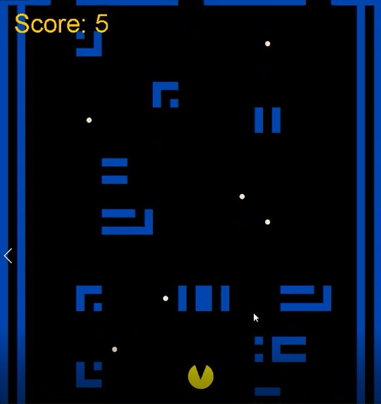

  

For ICS 111, My team was assigned a project to develop an original game in java. The game had to have at least one user controlled character and had to be a decent challenge. The concept also had to be approved before we could start on the game.

The game concept we came up with was "Infinite Pacman", where we have a pacman character travel through an infinite, randomly generated maze that keeps going down. The game is an infinite point based game where you have to collect as many points as possible before inevitably losing. The rules of the game is if pacman eats a pellet, it's one point, and when he hits the bottom, the game is over. After we finished that concept, we coded in a feature that would progressively increase the speed of the game, making it harder to not hit the bottom. We also decided to throw in power pellets that are worth one point, but temporarily freezes the maze so that pac man can escape from hitting the bottom. 

The game earned my group an A and we are all quite proud of what we have made.

<a href="https://github.com/tkansaki/tkansaki.github.io/tree/master/projects/Infinite%20Pacman">Source code</a>

